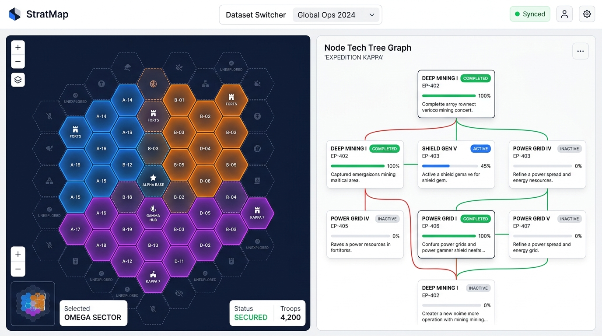

# StratMap 🗺️⚡

> **A strategic visualization dashboard synchronizing Jira project execution with competitive market intelligence.**

[](https://github.com/FranekJemiolo/stratmap/actions/workflows/deploy.yml)
[](https://franekjemiolo.github.io/stratmap/)
[](https://opensource.org/licenses/MIT)

---

## 🎯 Overview

**StratMap** is a client-side strategic dashboard designed for product executives, engineering leaders, and strategy teams. It bridges internal project execution (Jira Epics and dependency graphs) with competitive market intelligence (territory battle maps) into an interactive, synchronized dual-pane view:

- **Left Pane (60% width) — The Battle Map**: An interactive Axial $(q, r)$ SVG Hex Grid displaying market territory, clusters, ownership (`Us`, `Competitor A`, `Competitor B`), and a Fog of War rendering (dashed borders, 50% opacity) for rumored intelligence.
- **Right Pane (40% width) — The Tech Tree**: A hierarchical DAG rendered using `@xyflow/react` and `@dagrejs/dagre`, displaying epics, completion statuses, progress bars, and directional dependency edges (`blocks` in solid red, `accelerates` in dotted green).
- **Cross-Pane Bi-Directional Highlighting**:
  - Clicking a Hex territory highlights it, smoothly centers the Tech Tree on the linked Jira Epic, and dims non-related nodes.
  - Clicking an Epic node in the Tech Tree highlights all corresponding market territories on the Battle Map.

---

## 📸 Screenshots

<!-- Placeholder for final application screenshots -->
<div align="center">
  
</div>

---

## 🛠️ Tech Stack

| Domain | Technology | Purpose |
| :--- | :--- | :--- |
| **Framework** | [React 19](https://react.dev/) + [TypeScript](https://www.typescriptlang.org/) | Type-safe declarative UI components |
| **Build Tool** | [Vite 6+](https://vite.dev/) | Lightning-fast static bundling and HMR |
| **Styling** | [Tailwind CSS](https://tailwindcss.com/) | Minimalist, modern SaaS aesthetic |
| **Graph DAG Engine** | [@xyflow/react](https://reactflow.dev/) + [@dagrejs/dagre](https://github.com/dagrejs/dagre) | Automated hierarchical layout for Epics |
| **Battle Map Engine** | Custom SVG Hex Grid | Axial $(q, r)$ coordinate math, zoom/pan, Fog of War |
| **State Management** | [Zustand](https://github.com/pmndrs/zustand) | Ultra-lightweight synchronized selection store |
| **Testing** | [Vitest](https://vitest.dev/) + [React Testing Library](https://testing-library.com/) | Unit and integration test coverage |
| **CI/CD** | GitHub Actions | Automated linting, test suite execution, and GitHub Pages deployment |

---

## 🚀 Getting Started

### Prerequisites

- Node.js 20+
- npm 10+

### Installation

```bash
# Clone repository
git clone https://github.com/FranekJemiolo/stratmap.git
cd stratmap

# Install dependencies
npm install
```

### Local Development

```bash
# Start Vite development server
npm run dev
```

Visit `http://localhost:5173/stratmap/` in your browser.

### Running Tests & Quality Checks

```bash
# Run unit and integration tests with Vitest
npm run test

# Run linter
npm run lint

# Format codebase
npm run format

# Verify production build
npm run build
```

---

## 📊 Data Architecture

StratMap operates as a static client-side application loaded from structured mock data exports:

1. **`src/data/internal_execution.json`**: Represents Jira epics, progress indicators ($0-100\%$), statuses (`Done`, `In Progress`, `To Do`), and relational arrays (`blocks`, `accelerates`).
2. **`src/data/market_intel.json`**: Represents market territories mapped to axial coordinates $(q, r)$, cluster names, ownership, capture status, confidence levels (`Confirmed`, `Rumored`), and `associatedEpicId`.

---

## 🌐 Live Deployment

StratMap is automatically tested, built, and deployed to GitHub Pages on every push to the `main` branch via GitHub Actions:

🔗 **[https://franekjemiolo.github.io/stratmap/](https://franekjemiolo.github.io/stratmap/)**

---

## 📄 License

MIT © [Franek Jemiolo](https://github.com/FranekJemiolo)
